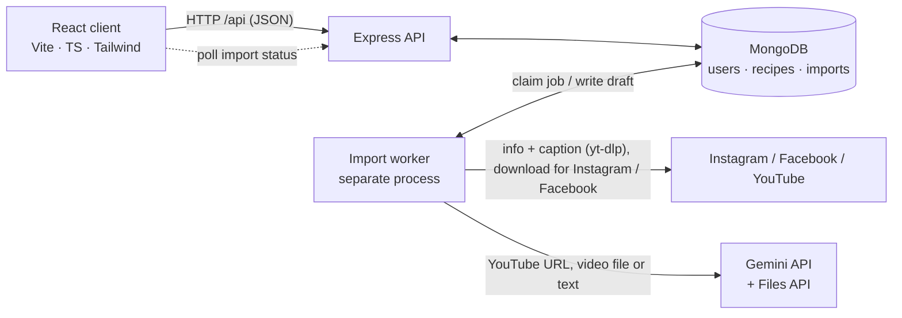
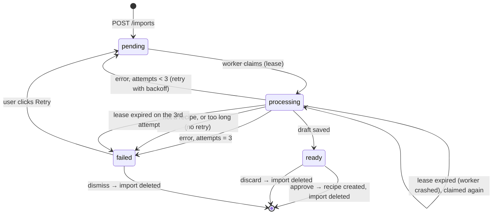

# Pinch — system design

> **Pinch** — pinch a recipe from a reel, cook it later.
> A learning project: system design first, then code that is simple enough to read line by line.

Status: **design agreed, 2026-10-29.** Changes to the design are made in this file.

---

## 1. Requirements

### Functional (v1)

1. **Import from a link.** The user pastes a link to an Instagram, Facebook or YouTube reel or
   video. The system turns it into a structured recipe.
2. **Fallback input.** If a link can't be read, the user can paste the caption text or upload
   screenshots instead.
3. **Draft and review.** An import produces a **draft**. Nothing is saved as a recipe until the
   user reviews, edits and approves it.
4. **Import status.** The user sees each import's progress (`waiting → fetching → analyzing →
   ready to review`) or a readable failure with **Retry**.
5. **Categorize.** The AI tags each recipe by cuisine, meal, diet, flavor and best fit.
6. **Nutrition.** An estimate per serving (calories, protein, carbs, fat), marked as an estimate.
7. **Manage.** Create a recipe by hand, edit it, delete it.
8. **Find.** Free-text search plus tag filters, newest first.
9. **Ownership.** Every recipe belongs to one user and only that user sees it.
10. **Cook mode.** A recipe opens for cooking: one step at a time in large type, with the
    screen kept on (docs/ux/plan.md U2).

### Placeholders (UI only, no backend in v1)

- **Share** — a button that says "coming soon".
- **Comments** — a section that says "coming soon". (When built: its own collection, never an
  array inside the recipe, because it grows without limit.)

### Later

Auth (see §8.3), share, comments, a WhatsApp bot or PWA share target, nutrition from a real
database, semantic search ("recipes like this one").

### Out of scope

Meal planning, shopping lists, scaling servings, Instagram/Facebook **stories** from a link
(they expire after 24h and are usually private; the screenshot fallback covers them).

### Non-functional

| Concern | Target |
|---|---|
| Scale | ~100 users × ~100 recipes (a POC) |
| Responsive | Phone first; works on tablet and desktop |
| Look and feel | Clean and friendly; it should feel finished |
| CRUD latency | < 300 ms |
| Import time | Typically < 60 s, always **asynchronous**: the UI never waits on it |
| Video length | ≤ 3 minutes (checked before downloading when the platform reports it; otherwise right after, see §4.1) |
| Reliability | A crash never loses an import or creates a duplicate recipe |
| Media | **Never stored**, beyond an import's own: a video lives for one attempt, uploaded screenshots until the draft is made (§6). Only text, plus a tiny thumbnail (§5) |
| Cost | Imports per user per day are capped (default 20) |
| Code | Simple and consistent above all — every line should be easy to read |

## 2. Back-of-envelope numbers

- Recipe text ≈ 5 KB, thumbnail ≈ 30 KB → **≈ 35 KB per recipe**.
- 10,000 recipes ≈ **350 MB**: tiny for MongoDB, so one database server is plenty.
- Videos never reach our database. The largest object we hold is a temp video file for about a minute.
- Gemini calls take seconds and cost money. That is why imports are asynchronous and capped.

## 3. High-level design


```mermaid
flowchart LR
  C[React client<br/>Vite · TS · Tailwind] -- "HTTP /api (JSON)" --> A[Express API]
  C -. "poll import status" .-> A
  A <--> M[(MongoDB<br/>users · recipes · imports)]
  W[Import worker<br/>separate process] <-- "claim job / write draft" --> M
  W -- "info + caption (yt-dlp), download for Instagram / Facebook" --> S[Instagram / Facebook / YouTube]
  W -- "YouTube URL, video file or text" --> G[Gemini API<br/>+ Files API]
```

Three processes, one codebase:

| Process | Job |
|---|---|
| **client** | The React app. Talks only to the API. |
| **API** | Express. Validates input, reads and writes Mongo, creates import jobs. Never calls Gemini or downloads anything, so it always answers fast. |
| **worker** | A loop that claims import jobs from Mongo, does the slow work and writes the result back. Started with its own command; can crash or be restarted without touching the API. |

Mongo is the only shared state. There is no Redis, no queue service and no object storage.

## 4. The import pipeline

### 4.1 Flow

1. The client sends `POST /api/imports` with `{ type: "link", url }` or `{ type: "text", text }`.
   The API validates it, finds a link's platform (`instagram | facebook | youtube`), checks the
   daily cap, creates an import with
   `status: "pending"` and answers **202** with the import.
2. The worker **claims** the job, then:
   - **Every link** → read the post's info with `yt-dlp`: its length, checked against the
     limit, and its **caption**, which often holds the full recipe with quantities (D15).
   - **YouTube** → no download: send the URL to Gemini directly (Gemini can watch public
     YouTube videos).
   - **Instagram / Facebook** → one `yt-dlp` call reads the info and downloads to a temp
     folder (100 MB at most, when the platform says the size); upload to the **Gemini Files
     API**. Instagram doesn't report a length, so for it the length is checked after the
     download with `ffprobe` (the spike found reels of 3–11 MB); a long Facebook video is
     downloaded before it's turned down. A post with no video (a photo post) is read from its
     caption alone.
   - **Text / screenshots** (fallback) → send them to Gemini as they are: no `yt-dlp`, no
     video. Pasted text is the post's text, so it's fenced as data like a caption (§9).
3. Gemini gets the video and the caption together and returns JSON that matches our recipe
   schema (structured output). The worker **validates it with Zod**, makes the thumbnail
   (§5), saves `draft` on the import, sets `status: "ready"`.
4. **Cleanup in `finally`**: delete the temp file and the Gemini file. Media lives for about a minute.
5. The client polls `GET /api/imports` (all of them in one request) every 2 s while any is
   pending or processing, then stops; a ready one is opened for review.
6. The user edits and approves → `POST /api/imports/:id/approve` → a recipe is created (with
   the draft's nutrition estimate, which the form doesn't edit) and the import is deleted (§4.4).

### 4.2 States


```mermaid
stateDiagram-v2
  [*] --> pending: POST /imports
  pending --> processing: worker claims (lease)
  processing --> ready: draft saved
  processing --> pending: error, attempts < 3 (retry with backoff)
  processing --> failed: error, attempts = 3
  processing --> failed: not a recipe, or too long (no retry)
  processing --> processing: lease expired (worker crashed), claimed again
  processing --> failed: lease expired on the 3rd attempt
  failed --> pending: user clicks Retry
  ready --> [*]: approve → recipe created, import deleted
  ready --> [*]: discard → import deleted
  failed --> [*]: dismiss → import deleted
```

`step` (`fetching | analyzing`) is shown inside `processing` for progress. The extractor sets
it as each part starts (a link is fetched, then analyzed; a text is only analyzed), only while
the attempt still holds the job, as every worker write. A claim starts it empty, and every end
of an attempt clears it.

### 4.3 Worker mechanics (the queue lessons)

- **Atomic claim.** One `findOneAndUpdate` both finds and takes a job, so two workers can never
  take the same one:
  ```js
  findOneAndUpdate(
    { $or: [
        { status: "pending", nextAttemptAt: { $lte: now } },
        { status: "processing", leaseUntil: { $lt: now } },   // a crashed worker's job
    ] },
    { $set: { status: "processing", leaseUntil: now + 3min }, $inc: { attempts: 1 },
      $unset: { step: "" } },                                   // a crashed attempt's step
    { sort: { createdAt: 1 } },
  )
  ```
- **Lease.** If the worker dies mid-job, `leaseUntil` passes and the job is claimed again (the
  same idea as an SQS visibility timeout).
- **Deadline.** A whole attempt must finish inside its lease, or a second worker would claim a
  job that is still running. So each attempt has a deadline under the lease (about 150 s),
  and every external call in it (`yt-dlp`, upload, Gemini) has a timeout inside that. In the
  spike one Gemini call hung for 27 minutes. A timeout is a failed attempt and retries as usual.
- **Retries with backoff.** A failed attempt goes back to `pending` with `nextAttemptAt` = now +
  10 s, then 60 s. After 3 attempts → `failed` with a readable `error`. A failure no retry can
  fix (not a recipe, a video over 3 minutes) fails the import at once, with its own message
  and `noRetry: true` (D23): the list offers only Dismiss, and the API refuses its retry. A
  job whose worker died on its third attempt is failed when it's claimed again, not run a
  fourth time.
- **Back-pressure.** At most **2 jobs at a time** per worker, to stay within Gemini rate limits.
- **Idle polling.** With nothing to do, the worker checks again after 1 s.
- **Errors don't stop it.** A database error (Mongo restarting) is logged, and the loop tries
  again after 1 s, rather than end the worker: in development nothing would start it again. A
  job it held is claimed again when its lease runs out.
- **Stalled.** An import still unclaimed 5 minutes after it was due (`nextAttemptAt`, or a
  held one's `leaseUntil`) means no worker is running: the API marks it `stalled`, and the
  client says so and offers Dismiss instead of "working on it" forever. Not exact: with more
  than about four links queued ahead (two at a time, up to 150 s each), a waiting one shows as
  stalled though the workers are busy. Fine for one user; a worker heartbeat would be exact.
- **Expiry.** Every import has `expiresAt` = 7 days; a **TTL index** makes Mongo delete abandoned
  imports by itself.

### 4.4 Approve is idempotent

Approve does two writes: create the recipe, delete the import. A crash between them must not
create a duplicate recipe when the user clicks again.

- The recipe stores `sourceImportId` under a **unique, sparse index**.
- Approve: insert the recipe; on duplicate-key error (`11000`) treat it as "already done"; then
  delete the import. The recipe's `source` is the import's link and platform.
- Repeating approve always ends with exactly one recipe and no import. No transaction and no
  replica set needed. (Chosen over a transaction: §8, decision D9.)

### 4.5 Link extraction risks

| Source | How | Risk |
|---|---|---|
| YouTube | Gemini reads the URL; `yt-dlp` reads the length and caption | Low; public videos only |
| Instagram reel/post | `yt-dlp` download | Medium: breaks when Instagram changes; public posts needed no cookies in the spike; a grey area under Instagram's terms — acceptable for a personal POC, not for a product |
| Facebook reel | `yt-dlp` download | Same as Instagram |
| Stories | Not supported from a link | Use the screenshot fallback |

**The spike (M0)** measured this before building anything else: 12 real links (6 YouTube, 3
Instagram, 3 Facebook). `yt-dlp` read all of them without cookies; Gemini turned 10 into
recipes, correctly rejected one promo, and one call hung. Results and findings are in
`docs/spike-results.md`.

## 5. Thumbnails

Media is thrown away, but a good-looking list needs images, so each recipe keeps **one tiny
thumbnail** inside its document: WebP inside 400 × 500 (its own shape kept), 20–40 KB, made
with `sharp`, with its width and height so the page keeps its place before it loads. The
worker saves it on the import as soon as it has it (as the step), reading at most 5 MB, from
https, with no redirect; approve copies it to the recipe, and editing keeps it (D20). Making it
never fails an import: no picture, no thumbnail.

| Source | Thumbnail from |
|---|---|
| Instagram / Facebook / YouTube | The post's own picture (`yt-dlp`'s `thumbnail`: the reel's cover, YouTube's image), fetched at once (the platforms' links expire) and resized. Chosen over a frame cut with `ffmpeg`: the cover is the picture the author chose, and one path serves all three |
| Screenshots | The first screenshot, resized |
| Text / manual | None → a colored placeholder with the cuisine's emoji |

Served by `GET /api/recipes/:id/thumbnail` (a draft's by `GET /api/imports/:id/thumbnail`) with
long cache headers; every query that answers recipes or imports leaves the image out, so list
responses stay small.

## 6. Data model (MongoDB)

```ts
User {
  _id, email, name, createdAt
  // passwordHash etc. arrive with auth (§8.3)
}

Recipe {
  _id, ownerId, title, description?,
  ingredients: [{ name, quantity?, unit?, note? }],   // quantity is text: "1/2", "a pinch"
  steps: [string],
  tags: [string],                  // "cuisine:italian", "flavor:spicy" — see §7
  servings?, prepMinutes?, cookMinutes?,
  nutritionPerServing?: { calories, proteinG, carbsG, fatG },   // always Gemini's estimate (D14)
  thumbnail?: { webp: Binary, width, height },   // the image left out of every query that answers
  source: { type: "instagram" | "facebook" | "youtube" | "text" | "image" | "manual", url? },
  sourceImportId?,                 // unique + sparse (§4.4)
  createdAt, updatedAt
}

Import {
  _id, ownerId,
  status: "pending" | "processing" | "ready" | "failed",
  step?: "fetching" | "analyzing",
  input: { type: "link" | "text" | "images", url?, platform?, text?, count?, images? },
  attempts, nextAttemptAt, leaseUntil?, error?, noRetry?,
  draft?: RecipeDraft, thumbnail?: { webp: Binary, width, height },   // named as on a recipe
  createdAt, updatedAt, expiresAt   // TTL
}

Usage {                            // the daily cap (D22)
  ownerId, day: "2026-11-07",      // the UTC day
  imports,                         // links pasted + Retry clicks that day
  expiresAt                        // TTL: two days later
}
```

Uploaded screenshots for the fallback (up to 4 PNG, JPEG or WebP files, each made a JPEG at
most 1600 px on a side by the API: typically 200–400 KB, under 2 MB at worst) are held on the import (`input.images`) only until the draft is made:
a failed attempt keeps them for the next try; the import's TTL deletes them in any case.
Every query that answers imports leaves them out.

### Indexes

| Collection | Index | Serves |
|---|---|---|
| recipes | `{ ownerId: 1, tags: 1, createdAt: -1, _id: -1 }` | My recipes, filtered by tags, newest first |
| recipes | `{ ownerId: 1, createdAt: -1, _id: -1 }` | My recipes, no filter, cursor pagination |
| recipes | `{ ownerId: 1, title: "text", "ingredients.name": "text" }` | Text search inside my recipes |
| recipes | `{ sourceImportId: 1 }` unique, sparse | Idempotent approve |
| imports | `{ status: 1, nextAttemptAt: 1 }` | The worker's claim query |
| imports | `{ ownerId: 1, createdAt: -1, _id: -1 }` | "My imports" list in the UI |
| imports | `{ expiresAt: 1 }` TTL (`expireAfterSeconds: 0`) | Automatic cleanup |
| usage | `{ ownerId: 1, day: 1 }` unique | Today's count (the daily cap) |
| usage | `{ expiresAt: 1 }` TTL | Old days go |

Every index is checked with `.explain("executionStats")`: expect `IXSCAN`, and
`totalDocsExamined` close to `nReturned`.

**Sample data:** `npm run db:seed` adds ten sample recipes for the dev user (§8.3), so the
list, search and filters have something to find; the e2e run seeds its own database the same
way. Each sample has a fixed id and is written only when it's missing: running it again
leaves an edited sample as it is, and puts back one that was deleted.

## 7. Find

**Tags are one flat array of `facet:value` strings.** MongoDB can't put two array fields in one
compound index ("parallel arrays"), so separate `cuisine[]` and `flavor[]` arrays could not be
indexed together. One array can.

Facets and their allowed values (fixed lists, so filters stay clean; the AI must pick from them):

| Facet | Values (first draft) |
|---|---|
| `cuisine` | italian, asian, middle-eastern, mexican, american, french, indian, mediterranean, other |
| `meal` | breakfast, lunch, dinner, snack, dessert, drink |
| `diet` | vegetarian, vegan, gluten-free, dairy-free, kosher-dairy, kosher-meat, parve |
| `flavor` | sweet, savory, spicy, sour, smoky, fresh |
| `fit` | quick, weeknight, meal-prep, party, kids, healthy, comfort |

Queries:

- **Filters only:** `{ ownerId, tags: { $all: [...] } }`, sorted by `createdAt: -1`, **cursor
  pagination** on `(createdAt, _id)`: the next page asks for items older than the last one seen.
  (`skip` reads and throws away every skipped document, so it gets slower page by page.)
- **The cursor** is the last recipe's `(createdAt, _id)`; the next page is
  `{ $or: [{ createdAt < c }, { createdAt = c, _id < id }] }` plus a plain `createdAt ≤ c`.
  Without that range, Mongo's chosen plan scanned the index from the newest recipe and dropped
  the pages before (`explain`: 101 documents read for a page of 51). A page asks for 51 and
  answers 50, so `nextCursor` is null on the last page instead of pointing at an empty one.
- **Tags:** the index holds one entry per tag of a recipe (multikey), so with two tags the scan
  reads the recipes with the **first** tag of `$all` and checks the other on each; Mongo doesn't
  pick the rarer one. With every recipe a dinner and half Italian, `cuisine:italian,meal:dinner`
  reads 51 documents for a page of 51 (`explain`, in a test), `meal:dinner,cuisine:italian`
  reads 101. Either is fast at this scale, and never more than my recipes with that one tag; if
  it matters later, the route can put the narrower facet first.
- **Text search:** `{ ownerId, $text: { $search: q } }` plus the same tag filter, sorted by text
  score, first 50 results. At POC scale that is enough; no deep pagination for search. A
  recipe matches if any word of `q` is in its title or an ingredient's name. The text index
  stems English ("eggs" finds "egg"); Mongo has no Hebrew stemmer, so Hebrew matches whole
  words only ("חריף" doesn't find "חריפה"). Quotes ask for a phrase and a leading "-" leaves a
  word out (Mongo's `$search` syntax); a search of only stop words ("the") finds nothing.
  Smarter search is semantic search, later (§1).

## 8. API

All under `/api` (the health routes too, so the Vite proxy covers everything), JSON, errors as
`{ error: { code, message } }` (plus `fields` for invalid input, §8.1). `ownerId` always comes from
the request's user (§8.3), never from the body or the URL.

```
GET    /api/health                     the process is up
GET    /api/ready                      the database is reachable

GET    /api/recipes?q=…&tags=cuisine:italian,flavor:spicy&cursor=…   → { items, nextCursor }
POST   /api/recipes                    create by hand
GET    /api/recipes/:id
PUT    /api/recipes/:id                replace what the user can edit (the form sends it all)
DELETE /api/recipes/:id
GET    /api/recipes/:id/thumbnail      image/webp

POST   /api/imports                    { type: "link", url } | { type: "text", text }  → 202 import (429 past the daily cap)
POST   /api/imports/screenshots        a form: up to 4 images (10 MB each) as "images"  → 202 import { type: "images", count }
GET    /api/imports                    my imports that are not done yet
GET    /api/imports/:id                status, step, error, draft
GET    /api/imports/:id/thumbnail      image/webp: the draft's picture
POST   /api/imports/:id/approve        the edited draft, as POST /api/recipes; nutritionPerServing and the thumbnail from the stored import (D20) → 201 recipe (409 if not ready)
POST   /api/imports/:id/retry          failed → pending, attempts, error and noRetry cleared → 202 (409 if not failed, or noRetry)
DELETE /api/imports/:id                discard / dismiss
```

One set of **Zod schemas** defines the Gemini output, the API input and the TypeScript types,
so they can't drift apart.

### 8.1 Validation

Every request body and query string is parsed with Zod before it reaches the handler. Invalid
input → 400 `invalid_input` with `fields`: each failed field by its path and a message the form
can show, e.g. `{ "title": "Give the recipe a title.", "ingredients.0.name": "Name the
ingredient." }`. A missing body, or one that isn't JSON → 400 `bad_request`; too large → 413
`too_large`.

The form checks with the same schema before it sends (shared `fieldErrors` builds `fields` on
both sides), so the user sees the API's messages without a round trip; the API's 400 is still
shown the same way, under the field it names.

### 8.2 Errors

Handlers throw; one Express error middleware turns errors into the JSON shape above and logs
them. No try/catch in each route.

### 8.3 Auth — later, but designed in now

v1 has no login. A small middleware sets `req.userId` from config `DEV_USER_ID` (not a secret,
so it has a default and needs no `.env` entry; `db:seed` creates that user when users are needed).
Every query already filters by `ownerId: req.userId`. When auth is built, **only that middleware
changes**. The planned design:

- Passwords hashed with argon2id (or bcrypt); emails stored lowercase.
- A random 32-byte session token in an `HttpOnly; Secure; SameSite=Lax` cookie. The database
  stores only its SHA-256 hash in a `sessions` collection with a TTL index.
- CSRF: SameSite=Lax, one origin (Vite proxies `/api` in dev), JSON-only mutations.
- A new session on every login, the same error for wrong email or password, and a login rate limit.
- Out of the first auth milestone: password reset, email verification, Google sign-in.

## 9. Gemini

- One function, `geminiExtract` (`server/src/worker/geminiExtract.ts`): an import's input → the
  model's JSON, which the worker checks with Zod. The worker doesn't know anything else about
  Gemini, so the model or provider can change in one place.
- The current Gemini Flash model (`gemini-3.5-flash`, checked in M5), with **structured
  output**: the response schema is generated from the Zod schema (`z.toJSONSchema`, input
  side), without `maxItems`, which Gemini refuses; Zod still checks those limits.
- The input is the video (or text / screenshots) **plus the post's caption** (D15). The caption
  is a stranger's text: it is sent as data to read, never as instructions, and the output is
  still bound by the schema, Zod and the user's review.
- The prompt asks for: title, ingredients with quantities and units, steps, servings, times, tags
  from the fixed lists only, and a nutrition estimate per serving. If the video isn't a recipe,
  the model says so and the import fails with "This doesn't look like a recipe".
- The recipe is written **in the language of the post**; tags stay English codes (D16).
- Every call has a **timeout** (the client's: 120 s a request), and the attempt's deadline
  (§4.3) cuts the whole attempt. No retries of its own (the SDK only retries when asked), except
  an upload's chunks, which the SDK tries up to 3 times: the worker's retries are the others.
- The worker uses the fake extractor of M4 instead when `EXTRACTOR=fake`: e2e runs that way,
  so no test calls Gemini.
- The output is validated with Zod anyway; invalid output counts as a failed attempt. The
  model often returns `""` for a field it doesn't know (e.g. `unit`); the schema treats an
  empty string as "not set".

## 10. Decisions log

| # | Decision | Why | Rejected |
|---|---|---|---|
| D1 | Import produces a draft that the user approves | AI makes mistakes; nothing wrong gets saved | Saving straight away |
| D2 | Asynchronous imports with a job document | Imports take up to a minute and can fail; requests must not wait | One long request |
| D3 | A separate `imports` collection | Recipes stay clean; different shape and lifecycle; TTL cleanup | A `status` field on recipes |
| D4 | Mongo as the queue (atomic claim + lease) | No extra infrastructure; teaches how queues work | Redis + BullMQ |
| D5 | The worker is a separate process | Crash isolation; scales on its own; the API always stays fast | Worker inside the API process |
| D6 | No media stored; only a ~30 KB thumbnail | Less to store and protect; the list still looks good | Object storage; no images; hot-linking (Instagram image URLs expire) |
| D7 | Paste a link in v1; share-sheet channels later | Works everywhere today; every channel later just creates an import | WhatsApp bot, PWA share target, iOS Shortcut in v1 |
| D8 | `yt-dlp` for Instagram and Facebook, with a spike first and fallbacks | The only way to get the reel itself; fallbacks keep the user unblocked | Caption-only scraping, Meta oEmbed |
| D9 | Idempotent approve (unique `sourceImportId`) | Safe to repeat; works on a standalone Mongo | A transaction (needs a replica set) |
| D10 | Tags as one `facet:value` array from fixed lists; renaming or removing a value needs a migration of the stored recipes | One compound index; clean filters | Separate arrays per facet; free tags |
| D11 | Cursor pagination | Constant speed at any depth | `skip` / `limit` |
| D12 | Gemini | Reads video and YouTube URLs natively; has a Files API | Claude (needs frames + transcript for video) |
| D13 | Auth later, behind a dev-user middleware | Learn the core first; ownership is in every query from day one | Building auth first |
| D14 | Nutrition estimated by Gemini, labelled as an estimate | Good enough for a POC | A nutrition database lookup (later) |
| D15 | Send the post's caption to Gemini with the video | The spike: quantities are often only in the caption (missing quantities fell from 42/106 to 13/101), and it helps spot non-recipes | Video only |
| D16 | The recipe is in the language of the post | Nothing lost in translation; the model's choice was unstable without a rule | Always Hebrew; always English |
| D17 | The server runs on Node 24's built-in TypeScript type stripping | One fewer dependency; the spike already runs this way | `tsx` (node-api.md's default) |
| D18 | Schemas in an npm-workspace package `shared/`, used as TypeScript source with no build: its `exports` point at `src/index.ts`; Vite compiles it, and Node type-strips it because the workspace symlink resolves to a path outside `node_modules` | One copy for client and server, no build step | `server/src/schemas/` (node-api.md); a copy on each side; a built package |
| D19 | MongoDB through the native driver; Zod checks every write, and every response is parsed with its schema, which drops stored fields like `ownerId` | You see the real queries, which suits learning indexes; one schema layer, shared with the client | Mongoose (a second schema layer next to Zod) |
| D20 | Editing is `PUT`: it replaces what the user can edit and keeps the fields the server owns (`_id`, `ownerId`, `source`, `createdAt`, `sourceImportId`, `nutritionPerServing`, `thumbnail`), listed in the route | The form always sends the whole recipe, so a field the user clears is simply left out; no `null`/`""` rules | `PATCH` with `null` to clear a field |
| D21 | React Router (declarative: `<Routes>` in `App.tsx`, `useParams`, `Link`) | A handful of screens; the most familiar API and the least setup, easy to read line by line | TanStack Router (type-safe routes and loaders, more concepts) |
| D22 | The daily cap (20) counts links pasted and Retry clicks, in a per-user, per-UTC-day counter (`usage`) raised atomically by both routes; past it, 429 | Imports are deleted once done, so counting them would undercount; the unique `{ownerId, day}` index makes two first counts at once safe on a standalone Mongo (as D9); the routes are where a user asks for work; automatic retries (3 a link) aren't counted, so at most 60 Gemini calls a day | Counting each Gemini call in the worker (exact, but a link could be accepted and then fail with "limit reached") |
| D23 | "Not a recipe" and "too long" fail the import at once (`NoRetryError`, its message shown to the user); every other error is retried | Trying again gives the same answer and costs a Gemini call each time; the user learns why straight away; nor is the user offered a Retry that can't help, and would use one of the day's 20 | Retry everything (3 Gemini calls for a cat video, and a vague message) |

## 11. Risks

| Risk | Mitigation |
|---|---|
| Instagram/Facebook block `yt-dlp` | The spike first; fallback to text or screenshots; keep `yt-dlp` updated |
| Gemini invents ingredients or quantities | The caption as a second source (D15); draft review; Zod validation; a prompt that allows "unknown" |
| Nutrition numbers are wrong | Shown as "≈ estimate" |
| The estimate isn't redone when servings or ingredients are edited: it's Gemini's, for the draft as it came | Shown as "≈ estimate"; a nutrition database later (D14) |
| Gemini cost or rate limits | Daily cap per user; 2 jobs at a time; videos ≤ 3 min |
| Long or non-recipe videos | Length check before download (right after it when the platform doesn't report a length); "not a recipe" failure |
| A Gemini call hangs | A deadline per attempt under the lease, a timeout on every call (§4.3); then the normal retry |

## 12. Build plan (small PRs)

Each milestone is a few **small PRs** (roughly ≤ 300 changed lines each), which you read and merge.

| # | Milestone | Done when |
|---|---|---|
| M0 | **Spike** — `yt-dlp` + Gemini on real links (a script, not app code) | We know which sources work and the design is adjusted |
| M1 | **Scaffold** — client (Vite, React, TS, Tailwind), server (Express, TS, Mongo), dev-user middleware, error handling, one health route | Both run; the client calls the API |
| M2 | **Recipes CRUD** — create by hand, list, detail, edit, delete; responsive layout | A user can manage recipes by hand |
| M3 | **Find** — tags, text search, cursor pagination, indexes checked with `explain` | Search and filters are fast and correct |
| M4 | **Pipeline without AI** — imports, worker, claim, lease, retries, TTL, status UI, idempotent approve, using a fake extractor | The whole pipeline works and survives a killed worker |
| M5 | **Gemini** — `extractRecipe` for YouTube and text, tags, nutrition | A YouTube link becomes a draft |
| M6 | **Instagram / Facebook** — `yt-dlp`, Gemini Files, thumbnails, screenshot fallback | A reel link becomes a draft with a thumbnail |
| M7 | **Polish** — empty, loading and error states, share and comments placeholders, look and feel | It feels like a finished POC |
| Later | Auth, share, comments, WhatsApp bot / PWA share target, nutrition database, semantic search | — |

Doing M4 with a fake extractor first is deliberate (it takes 1.5 s a step, and fails every try of a link
with "fail" in it, to show retries): the queue lessons are learned without AI
noise, and M5/M6 only swap the extractor.

## 13. Open for the coding stage

- **Tests:** what gets tested first (the claim query, approve, Find queries).
- **The lighter kit:** how much of the agents setup to keep, given that you own the code and want small PRs.

## 14. Screens

Phone first (§1). Every screen sits in one frame: a header with the name (a link home) and
**New recipe**, a secondary button (from M4 the main action of `/` is pasting a link; hidden on
the recipe form's pages, new, edit and review, where Save is the main action, and in cook
mode); the content in a single readable column below it.

| Address | Screen | Its job | States |
|---|---|---|---|
| `/` | Your recipes | Paste a link, or a post's text, to pinch a recipe (from M4, the box and Your imports above the list, below), or add up to 4 screenshots of it (from M6; choosing them sends them). Pick something to cook; each card shows the title, the number of ingredients and the total time (from M6, the post's picture as a small 4:5 tile beside them). Search (on Enter) and tag filters (folded, applied as ticked) sit above the list and live in the address: `/?q=egg&tags=meal:dinner` | Loading (placeholder cards), empty (points to the paste box, and links to New recipe: "Write a recipe"), error (Try again); 50 at a time, then Show more (focus moves to the first new recipe; a failed page says so and keeps the list); filtered: how many match (announced), or none and a link to clear them |
| `/recipes/new` | New recipe | Write a recipe by hand; tags are chips to tick, a group per facet (§7) | From the first Save: each error under its field (§8.1), updated as the user types; focus on the first; saving (button says so); failed (says so, keeps what was typed) |
| `/recipes/:id` | A recipe | Read it (a range like "8–10" kept on one line; from M6 the post's picture at the top, at its shape; its tags under the title; from M5 the nutrition per serving, marked ≈ estimate); Cook, the main action; Edit, Share (from M7, "coming soon", unavailable), Delete (asks first); Comments under the steps (from M7, "coming soon") | Loading, error (Try again), not found |
| `/recipes/:id/cook` | Cook mode | One step at a time in large type ("Step 2 of 6"), Back and Next, Done on the last; the step's ingredients under it (those it names) and all of them folded below, ticked off in both at once; a timer for each time a step mentions ("20 min", "10 דקות"; a range's shorter end; hours and minutes as one; in words too: "half an hour", "חצי שעה"), each started once (pressed again while it runs, nothing: its button says Running), kept at the bottom of the screen (at most 40% of it), ringing (a beep, a buzz) and announced at zero; leaving cook mode ends them; the screen kept on (Wake Lock), and says so or that it may lock; focus stays on Back and Next/Done from step to step; Exit goes back to the recipe | Loading (the step's shape), error (Try again), not found |
| `/recipes/:id/edit` | Edit recipe | Change it; Cancel goes back to the recipe | Loading, error (Try again), not found; then as New recipe |
| `/imports/:id` | Review the recipe | Check the draft the worker made, in the recipe form (D1), under the post's picture (M6); Save approves it and opens the new recipe; Review later (the form's Cancel) keeps it; Discard, last in the form's buttons, deletes it and goes back to `/` | Loading, error (Try again), not found; no draft (not done yet, or failed): says so and links home; then as New recipe |
| anything else | Page not found | Get back to the recipes | — |

From M4 the paste-a-link box on `/` becomes the main action, and import status shows there:
"Your imports" under the box, each with its platform, its link and how far it has got (waiting,
working on it, trying again soon, ready to review, or why it failed); announced as it changes.
A ready one offers Review the recipe; a failed one, Retry (three more tries) and Dismiss, or
only Dismiss when no retry can fix it (D23); a stalled one (§4.3) says nothing is working on it, and offers Dismiss. Dismiss deletes it, with
no question: the link can be pasted again. A link from another site is refused under the box
before it's sent.

From M5 the box is a textarea and takes either, with nothing to choose (§1's text fallback):
one word is a link; anything with a space or a new line in it is the recipe's text ("Pasted
text" in Your imports, with its start). So a link with words around it is a text, and Gemini
finds no recipe in it: kept that simple on purpose. Too short a text (under 20 characters) is
refused as a link from another site is. Enter makes a new line, as in any textarea: Pinch it
sends.
